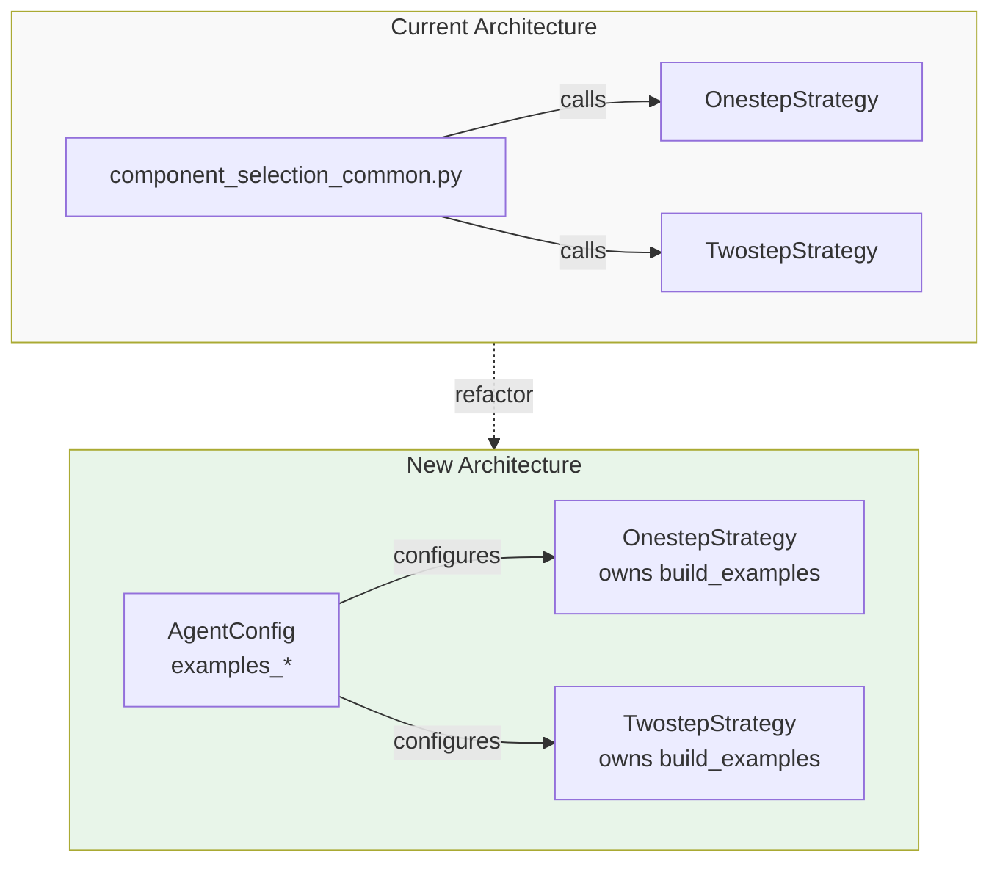

# Configurable Examples Templates for System Prompts

## Overview

Move example building methods from `[component_selection_common.py](libs/next_gen_ui_agent/component_selection_common.py)` to their respective strategy classes and make them configurable through template strings. This allows users to customize examples separately for normal components and charts in each strategy step.

## Current Architecture

Currently, three example building functions exist in `[component_selection_common.py](libs/next_gen_ui_agent/component_selection_common.py)`:

1. `**build_onestep_examples()**` (lines 223-297): Builds examples for one-step strategy
  - Hardcoded non-chart examples (table, one-card)
  - Hardcoded chart examples (chart-bar, chart-mirrored-bar)
2. `**build_twostep_step1select_examples()**` (lines 300-365): Builds examples for two-step step1
  - Hardcoded non-chart examples (table, one-card, image)
  - Hardcoded chart examples (chart-bar, chart-mirrored-bar)
3. `**build_twostep_step2configure_example()**` (lines 368-381): Gets example from metadata
  - Already pulls from `metadata[component]["twostep_step2configure_example"]`

Examples are conditionally included based on `has_non_chart_components()` and `has_chart_components()`.

## Architecture Diagram




## Implementation Plan

### 1. Update Type Definitions

**File:** `[libs/next_gen_ui_agent/types.py](libs/next_gen_ui_agent/types.py)`

Add new template fields to `AgentConfigPrompt` class (around line 191):

```python
class AgentConfigPrompt(BaseModel):
    # ... existing fields ...
    
    examples_normalcomponents: Optional[str] = Field(
        default=None,
        description="Override normal component examples (table, cards, image) for one-step strategy. If not set, uses default hardcoded examples.",
    )
    
    examples_charts: Optional[str] = Field(
        default=None,
        description="Override chart component examples for one-step strategy. If not set, uses default hardcoded examples.",
    )
    
    twostep_step1select_examples_normalcomponents: Optional[str] = Field(
        default=None,
        description="Override normal component examples (table, cards, image) for two-step strategy step1. If not set, uses default hardcoded examples.",
    )
    
    twostep_step1select_examples_charts: Optional[str] = Field(
        default=None,
        description="Override chart component examples for two-step strategy step1. If not set, uses default hardcoded examples.",
    )
```

### 2. Move and Refactor One-Step Strategy Examples

**File:** `[libs/next_gen_ui_agent/component_selection_llm_onestep.py](libs/next_gen_ui_agent/component_selection_llm_onestep.py)`

Move `build_onestep_examples()` from `component_selection_common.py` into the `OnestepLLMCallComponentSelectionStrategy` class as a method (around line 137):

```python
def _build_examples(
    self, allowed_components: set[str]
) -> str:
    """
    Build examples section for one-step strategy system prompt.
    
    Args:
        allowed_components: Set of allowed component names
    
    Returns:
        Formatted string with examples
    """
    # Combine normal components and chart examples
    examples = []
    
    normalcomponents_examples = self._build_normalcomponents_examples(allowed_components)
    if normalcomponents_examples:
        examples.append(normalcomponents_examples)
    
    chart_examples = self._build_chart_examples(allowed_components)
    if chart_examples:
        examples.append(chart_examples)
    
    return "\n\n".join(examples)

def _build_normalcomponents_examples(self, allowed_components: set[str]) -> str:
    """Build normal component examples (table, cards, image)."""
    if not has_non_chart_components(allowed_components):
        return ""
    
    # Check for custom template
    if (
        self.config.prompt
        and self.config.prompt.examples_normalcomponents
    ):
        return self.config.prompt.examples_normalcomponents
    
    # Default hardcoded examples
    return """Response example for multi-item data when table is suitable:
{
    "title": "Orders",
    "reasonForTheComponentSelection": "User explicitly requested a table, and data has multiple items with short field values",
    "confidenceScore": "95%",
    "component": "table",
    "fields" : [
        {"name":"Name","data_path":"orders[*].name"},
        {"name":"Creation Date","data_path":"orders[*].creationDate"}
    ]
}

Response example for one-item data when one-card is suitable:
{
    "title": "Order CA565",
    "reasonForTheComponentSelection": "One item available in the data",
    "confidenceScore": "75%",
    "component": "one-card",
    "fields" : [
        {"name":"Name","data_path":"order.name"},
        {"name":"Creation Date","data_path":"order.creationDate"}
    ]
}"""

def _build_chart_examples(self, allowed_components: set[str]) -> str:
    """Build chart component examples."""
    if not has_chart_components(allowed_components):
        return ""
    
    # Check for custom template
    if (
        self.config.prompt
        and self.config.prompt.examples_charts
    ):
        return self.config.prompt.examples_charts
    
    # Default hardcoded examples
    return """Response example for multi-item data when bar chart is suitable:
{
    "title": "Movie Revenue Comparison",
    "reasonForTheComponentSelection": "User wants to compare numeric values as a chart",
    "confidenceScore": "90%",
    "component": "chart-bar",
    "fields" : [
        {"name":"Movie","data_path":"movies[*].title"},
        {"name":"Revenue","data_path":"movies[*].revenue"}
    ]
}

Response example for multi-item data when mirrored-bar chart is suitable (comparing 2 metrics, note nested structure):
{
    "title": "Movie ROI and Budget Comparison",
    "reasonForTheComponentSelection": "User wants to compare two metrics (ROI and budget) across movies, which requires a mirrored-bar chart to handle different scales",
    "confidenceScore": "90%",
    "component": "chart-mirrored-bar",
    "fields" : [
        {"name":"Movie","data_path":"get_all_movies[*].movie.title"},
        {"name":"ROI","data_path":"get_all_movies[*].movie.roi"},
        {"name":"Budget","data_path":"get_all_movies[*].movie.budget"}
    ]
}"""
```

Update `_build_system_prompt()` method (around line 129) to call the new method:

```python
# Get filtered examples
response_examples = self._build_examples(allowed_components)

# Add examples if available
if response_examples:
    system_prompt += f"""

{response_examples}"""
```

### 3. Move and Refactor Two-Step Strategy Examples

**File:** `[libs/next_gen_ui_agent/component_selection_llm_twostep.py](libs/next_gen_ui_agent/component_selection_llm_twostep.py)`

Add similar methods to `TwostepLLMCallComponentSelectionStrategy` class:

```python
def _build_step1select_examples(
    self, allowed_components: set[str]
) -> str:
    """
    Build examples section for two-step step1 (component selection) system prompt.
    
    Args:
        allowed_components: Set of allowed component names
    
    Returns:
        Formatted string with examples
    """
    # Combine normal components and chart examples
    examples = []
    
    normalcomponents_examples = self._build_step1select_normalcomponents_examples(allowed_components)
    if normalcomponents_examples:
        examples.append(normalcomponents_examples)
    
    chart_examples = self._build_step1select_chart_examples(allowed_components)
    if chart_examples:
        examples.append(chart_examples)
    
    return "\n\n".join(examples)

def _build_step1select_normalcomponents_examples(self, allowed_components: set[str]) -> str:
    """Build normal component examples for step1."""
    if not has_non_chart_components(allowed_components):
        return ""
    
    # Check for custom template
    if (
        self.config.prompt
        and self.config.prompt.twostep_step1select_examples_normalcomponents
    ):
        return self.config.prompt.twostep_step1select_examples_normalcomponents
    
    # Default hardcoded examples (matching current build_twostep_step1select_examples)
    return """Response example for multi-item data when table is suitable:
{
    "reasonForTheComponentSelection": "User explicitly requested a table, and data has multiple items with short field values",
    "confidenceScore": "95%",
    "title": "Orders",
    "component": "table"
}

Response example for one-item data when one-card is suitable:
{
    "reasonForTheComponentSelection": "One item available in the data. Multiple fields to show based on the User query",
    "confidenceScore": "95%",
    "title": "Order CA565",
    "component": "one-card"
}

Response example for one-item data and image when image is suitable:
{
    "reasonForTheComponentSelection": "User asked to see the magazine cover",
    "confidenceScore": "75%",
    "title": "Magazine cover",
    "component": "image"
}"""

def _build_step1select_chart_examples(self, allowed_components: set[str]) -> str:
    """Build chart component examples for step1."""
    if not has_chart_components(allowed_components):
        return ""
    
    # Check for custom template
    if (
        self.config.prompt
        and self.config.prompt.twostep_step1select_examples_charts
    ):
        return self.config.prompt.twostep_step1select_examples_charts
    
    # Default hardcoded examples
    return """Response example for multi-item data when bar chart is suitable:
{
    "title": "Movie Revenue Comparison",
    "reasonForTheComponentSelection": "User wants to compare numeric values as a chart",
    "confidenceScore": "90%",
    "component": "chart-bar"
}

Response example for multi-item data when mirrored-bar chart is suitable (comparing 2 metrics):
{
    "title": "Movie ROI and Budget Comparison",
    "reasonForTheComponentSelection": "User wants to compare two metrics (ROI and budget) across movies, which requires a mirrored-bar chart to handle different scales",
    "confidenceScore": "90%",
    "component": "chart-mirrored-bar"
}"""
```

Update `_build_step1select_system_prompt()` method (around line 141) to call the new method:

```python
# Get filtered examples
response_examples = self._build_step1select_examples(allowed_components)

# Add examples if available
if response_examples:
    system_prompt += f"""

{response_examples}"""
```

### 4. Clean Up component_selection_common.py

**File:** `[libs/next_gen_ui_agent/component_selection_common.py](libs/next_gen_ui_agent/component_selection_common.py)`

- Remove `build_onestep_examples()` function (lines 223-297)
- Remove `build_twostep_step1select_examples()` function (lines 300-365)
- Keep `build_twostep_step2configure_example()` and `build_twostep_step2configure_rules()` (already use metadata)

Update imports in strategy files:

- Remove `build_onestep_examples` from `[component_selection_llm_onestep.py](libs/next_gen_ui_agent/component_selection_llm_onestep.py)` imports
- Remove `build_twostep_step1select_examples` from `[component_selection_llm_twostep.py](libs/next_gen_ui_agent/component_selection_llm_twostep.py)` imports

### 5. Create Comprehensive Tests

**File:** Create new test file `[libs/next_gen_ui_agent/component_selection_examples_test.py](libs/next_gen_ui_agent/component_selection_examples_test.py)`

Test coverage:

```python
"""Tests for configurable examples templates."""

import pytest
from next_gen_ui_agent import AgentConfig
from next_gen_ui_agent.types import AgentConfigPrompt

from .component_selection_llm_onestep import OnestepLLMCallComponentSelectionStrategy
from .component_selection_llm_twostep import TwostepLLMCallComponentSelectionStrategy


class TestOnestepExamples:
    """Test one-step strategy examples customization."""
    
    def test_default_examples_all_components(self):
        """Test default examples when all components allowed."""
        config = AgentConfig()
        strategy = OnestepLLMCallComponentSelectionStrategy(config=config)
        system_prompt = strategy.get_system_prompt()
        
        # Should include both common and chart examples
        assert "table" in system_prompt
        assert "one-card" in system_prompt
        assert "chart-bar" in system_prompt
        assert "chart-mirrored-bar" in system_prompt
    
    def test_default_examples_only_common(self):
        """Test default examples with only common components."""
        config = AgentConfig(selectable_components=["table", "one-card"])
        strategy = OnestepLLMCallComponentSelectionStrategy(config=config)
        system_prompt = strategy.get_system_prompt()
        
        # Should include only common examples
        assert "table" in system_prompt
        assert "one-card" in system_prompt
        assert "chart-bar" not in system_prompt
    
    def test_default_examples_only_charts(self):
        """Test default examples with only chart components."""
        config = AgentConfig(selectable_components=["chart-bar", "chart-line"])
        strategy = OnestepLLMCallComponentSelectionStrategy(config=config)
        system_prompt = strategy.get_system_prompt()
        
        # Should include only chart examples
        assert "chart-bar" in system_prompt
        assert "table" not in system_prompt
        assert "one-card" not in system_prompt
    
    def test_custom_normalcomponents_examples(self):
        """Test custom normal component examples."""
        custom_normalcomponents = """Custom table example:
{
    "component": "table",
    "title": "Custom Table"
}"""
        
        config = AgentConfig(
            prompt=AgentConfigPrompt(
                examples_normalcomponents=custom_normalcomponents
            )
        )
        strategy = OnestepLLMCallComponentSelectionStrategy(config=config)
        system_prompt = strategy.get_system_prompt()
        
        # Should use custom normal component examples
        assert "Custom table example" in system_prompt
        assert "Custom Table" in system_prompt
    
    def test_custom_chart_examples(self):
        """Test custom chart examples."""
        custom_chart = """Custom chart example:
{
    "component": "chart-bar",
    "title": "Custom Chart"
}"""
        
        config = AgentConfig(
            selectable_components=["chart-bar"],
            prompt=AgentConfigPrompt(
                examples_charts=custom_chart
            )
        )
        strategy = OnestepLLMCallComponentSelectionStrategy(config=config)
        system_prompt = strategy.get_system_prompt()
        
        # Should use custom chart examples
        assert "Custom chart example" in system_prompt
        assert "Custom Chart" in system_prompt
    
    def test_combined_custom_examples(self):
        """Test using both custom normalcomponents and charts examples together."""
        custom_normalcomponents = """Custom normal example:
{
    "component": "table",
    "title": "Custom Table"
}"""
        
        custom_charts = """Custom chart example:
{
    "component": "chart-bar",
    "title": "Custom Chart"
}"""
        
        config = AgentConfig(
            prompt=AgentConfigPrompt(
                examples_normalcomponents=custom_normalcomponents,
                examples_charts=custom_charts
            )
        )
        strategy = OnestepLLMCallComponentSelectionStrategy(config=config)
        system_prompt = strategy.get_system_prompt()
        
        # Should use both custom examples
        assert "Custom normal example" in system_prompt
        assert "Custom Table" in system_prompt
        assert "Custom chart example" in system_prompt
        assert "Custom Chart" in system_prompt


class TestTwostepStep1Examples:
    """Test two-step step1 examples customization."""
    
    def test_default_examples_all_components(self):
        """Test default examples when all components allowed."""
        config = AgentConfig()
        strategy = TwostepLLMCallComponentSelectionStrategy(config=config)
        system_prompt = strategy.get_system_prompt()
        
        # Should include both common and chart examples
        assert "table" in system_prompt
        assert "one-card" in system_prompt
        assert "image" in system_prompt
        assert "chart-bar" in system_prompt
    
    def test_custom_normalcomponents_examples(self):
        """Test custom normal component examples for step1."""
        custom_normalcomponents = """Custom step1 example:
{
    "component": "table",
    "title": "Custom Step1 Table"
}"""
        
        config = AgentConfig(
            prompt=AgentConfigPrompt(
                twostep_step1select_examples_normalcomponents=custom_normalcomponents
            )
        )
        strategy = TwostepLLMCallComponentSelectionStrategy(config=config)
        system_prompt = strategy.get_system_prompt()
        
        # Should use custom examples
        assert "Custom step1 example" in system_prompt
        assert "Custom Step1 Table" in system_prompt
    
    def test_custom_chart_examples(self):
        """Test custom chart examples for step1."""
        custom_chart = """Custom step1 chart:
{
    "component": "chart-line",
    "title": "Custom Chart"
}"""
        
        config = AgentConfig(
            selectable_components=["chart-line"],
            prompt=AgentConfigPrompt(
                twostep_step1select_examples_charts=custom_chart
            )
        )
        strategy = TwostepLLMCallComponentSelectionStrategy(config=config)
        system_prompt = strategy.get_system_prompt()
        
        # Should use custom chart examples
        assert "Custom step1 chart" in system_prompt
    
    def test_combined_custom_examples(self):
        """Test using both custom normalcomponents and charts examples together."""
        custom_normalcomponents = """Custom step1 normal:
{
    "component": "table",
    "title": "Custom Table"
}"""
        
        custom_charts = """Custom step1 chart:
{
    "component": "chart-line",
    "title": "Custom Chart"
}"""
        
        config = AgentConfig(
            prompt=AgentConfigPrompt(
                twostep_step1select_examples_normalcomponents=custom_normalcomponents,
                twostep_step1select_examples_charts=custom_charts
            )
        )
        strategy = TwostepLLMCallComponentSelectionStrategy(config=config)
        system_prompt = strategy.get_system_prompt()
        
        # Should use both custom examples
        assert "Custom step1 normal" in system_prompt
        assert "Custom step1 chart" in system_prompt


class TestBackwardCompatibility:
    """Test backward compatibility."""
    
    def test_no_custom_examples_works(self):
        """Test that existing code without custom examples continues to work."""
        config = AgentConfig()
        
        onestep = OnestepLLMCallComponentSelectionStrategy(config=config)
        assert onestep.get_system_prompt() is not None
        
        twostep = TwostepLLMCallComponentSelectionStrategy(config=config)
        assert twostep.get_system_prompt() is not None
```

### 6. Update Tests in component_selection_common_test.py

**File:** `[libs/next_gen_ui_agent/component_selection_common_test.py](libs/next_gen_ui_agent/component_selection_common_test.py)`

- Remove `TestBuildOnestepExamples` class (lines 202-237)
- Remove `TestBuildTwostepStep1SelectExamples` class (lines 241-276)
- Keep `TestBuildTwostepStep2ConfigureExample` class (already tests metadata-based function)
- Remove imports for removed functions

### 7. Update Documentation - configuration.md

**File:** `[docs/guide/configuration.md](docs/guide/configuration.md)`

Add new sections after the `chart_instructions_template` section (around line 228):

```markdown
#### `examples_normalcomponents` [`str`, optional]

Override the normal component examples (table, cards, image) for one-step strategy.

If not set, uses default hardcoded examples. For detailed information, see [Prompt Tuning - Examples Customization](llm.md#examples-customization).


#### `examples_charts` [`str`, optional]

Override the chart component examples for one-step strategy.

If not set, uses default hardcoded examples. For detailed information, see [Prompt Tuning - Examples Customization](llm.md#examples-customization).


#### `twostep_step1select_examples_normalcomponents` [`str`, optional]

Override the normal component examples (table, cards, image) for two-step strategy's first step.

If not set, uses default hardcoded examples. For detailed information, see [Prompt Tuning - Examples Customization](llm.md#examples-customization).


#### `twostep_step1select_examples_charts` [`str`, optional]

Override the chart component examples for two-step strategy's first step.

If not set, uses default hardcoded examples. For detailed information, see [Prompt Tuning - Examples Customization](llm.md#examples-customization).
```

### 8. Update Documentation - llm.md

**File:** `[docs/guide/llm.md](docs/guide/llm.md)`

Add new subsection after "Component-Specific Prompt Customization" (around line 177):

```markdown
#### Examples Customization

In addition to customizing the initial system prompt sections, you can also customize the response examples that help guide the LLM to produce correctly formatted output.

Examples can be customized at two levels:

1. **Normal Component Examples**: Customize examples for table, cards, and image components
2. **Chart Component Examples**: Customize examples for chart components

Both types of examples are automatically combined and included in the system prompt when their respective component types are enabled.

**One-Step Strategy Examples:**

```yaml
prompt:
  # Customize normal component examples
  examples_normalcomponents: |
    Example for financial transactions table:
    {
        "title": "Transaction History",
        "reasonForTheComponentSelection": "Displaying multiple transaction records with detailed fields",
        "confidenceScore": "95%",
        "component": "table",
        "fields": [
            {"name":"Transaction ID","data_path":"transactions[*].id"},
            {"name":"Amount","data_path":"transactions[*].amount"},
            {"name":"Date","data_path":"transactions[*].date"}
        ]
    }
  
  # Customize chart examples
  examples_charts: |
    Example for revenue comparison:
    {
        "title": "Quarterly Revenue",
        "reasonForTheComponentSelection": "Comparing revenue across quarters",
        "confidenceScore": "90%",
        "component": "chart-bar",
        "fields": [
            {"name":"Quarter","data_path":"data[*].quarter"},
            {"name":"Revenue","data_path":"data[*].revenue"}
        ]
    }
```

**Two-Step Strategy Step1 Examples:**

```yaml
prompt:
  # Customize normal component examples for step1
  twostep_step1select_examples_normalcomponents: |
    Medical records table example:
    {
        "reasonForTheComponentSelection": "Multiple patient records to display",
        "confidenceScore": "95%",
        "title": "Patient Records",
        "component": "table"
    }
  
  # Customize chart examples for step1
  twostep_step1select_examples_charts: |
    Patient metrics chart example:
    {
        "title": "Patient Vital Signs Trend",
        "reasonForTheComponentSelection": "Visualizing vital signs over time",
        "confidenceScore": "90%",
        "component": "chart-line"
    }
```

**Notes:**

- Examples are automatically combined: normal component examples followed by chart examples (if applicable)
- Examples are only included if relevant components are enabled in `selectable_components`
- You can customize just `*_normalcomponents`, just `*_charts`, or both
- Examples should match the JSON output format expected by your strategy
- Two-step step2 examples are already configurable via component metadata (`twostep_step2configure_example`)

```

Add to the "Complete Example" section (around line 265):

```yaml
# Add to the existing complete example:
prompt:
  # ... existing prompt customizations ...
  
  # Customize examples for financial domain
  examples_normalcomponents: |
    Example for transaction list:
    {
        "title": "Recent Transactions",
        "reasonForTheComponentSelection": "User requested transaction history with multiple records",
        "confidenceScore": "95%",
        "component": "table",
        "fields": [
            {"name":"Date","data_path":"transactions[*].date"},
            {"name":"Amount","data_path":"transactions[*].amount"},
            {"name":"Category","data_path":"transactions[*].category"}
        ]
    }
  
  examples_charts: |
    Example for revenue trend:
    {
        "title": "Monthly Revenue Trend",
        "reasonForTheComponentSelection": "Analyzing revenue growth over time",
        "confidenceScore": "90%",
        "component": "chart-line",
        "fields": [
            {"name":"Month","data_path":"data[*].month"},
            {"name":"Revenue","data_path":"data[*].revenue"}
        ]
    }
```

## Files to Modify

1. `[libs/next_gen_ui_agent/types.py](libs/next_gen_ui_agent/types.py)` - Add 6 new example template fields
2. `[libs/next_gen_ui_agent/component_selection_common.py](libs/next_gen_ui_agent/component_selection_common.py)` - Remove 2 example functions
3. `[libs/next_gen_ui_agent/component_selection_llm_onestep.py](libs/next_gen_ui_agent/component_selection_llm_onestep.py)` - Add 3 new example methods
4. `[libs/next_gen_ui_agent/component_selection_llm_twostep.py](libs/next_gen_ui_agent/component_selection_llm_twostep.py)` - Add 3 new example methods
5. `[libs/next_gen_ui_agent/component_selection_examples_test.py](libs/next_gen_ui_agent/component_selection_examples_test.py)` - Create new test file
6. `[libs/next_gen_ui_agent/component_selection_common_test.py](libs/next_gen_ui_agent/component_selection_common_test.py)` - Remove obsolete tests
7. `[docs/guide/configuration.md](docs/guide/configuration.md)` - Add reference documentation
8. `[docs/guide/llm.md](docs/guide/llm.md)` - Add detailed examples customization section

## Benefits

- **Modularity**: Example building logic moves to the classes that use it
- **Flexibility**: Users can customize examples for different domains and use cases
- **Granular Control**: Separate customization for normal components vs charts
- **Simplicity**: Direct customization without complex template placeholders
- **Backward Compatible**: Default behavior matches current implementation
- **Consistent API**: Follows the same pattern as the previous prompt tuning feature

