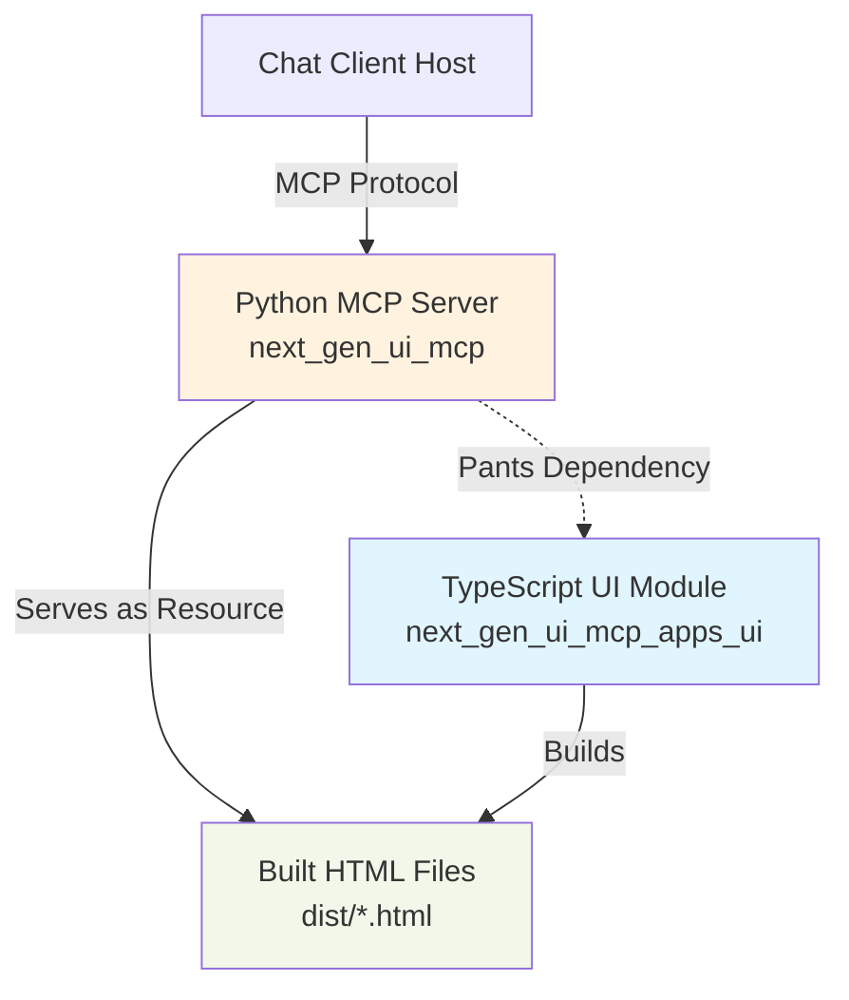
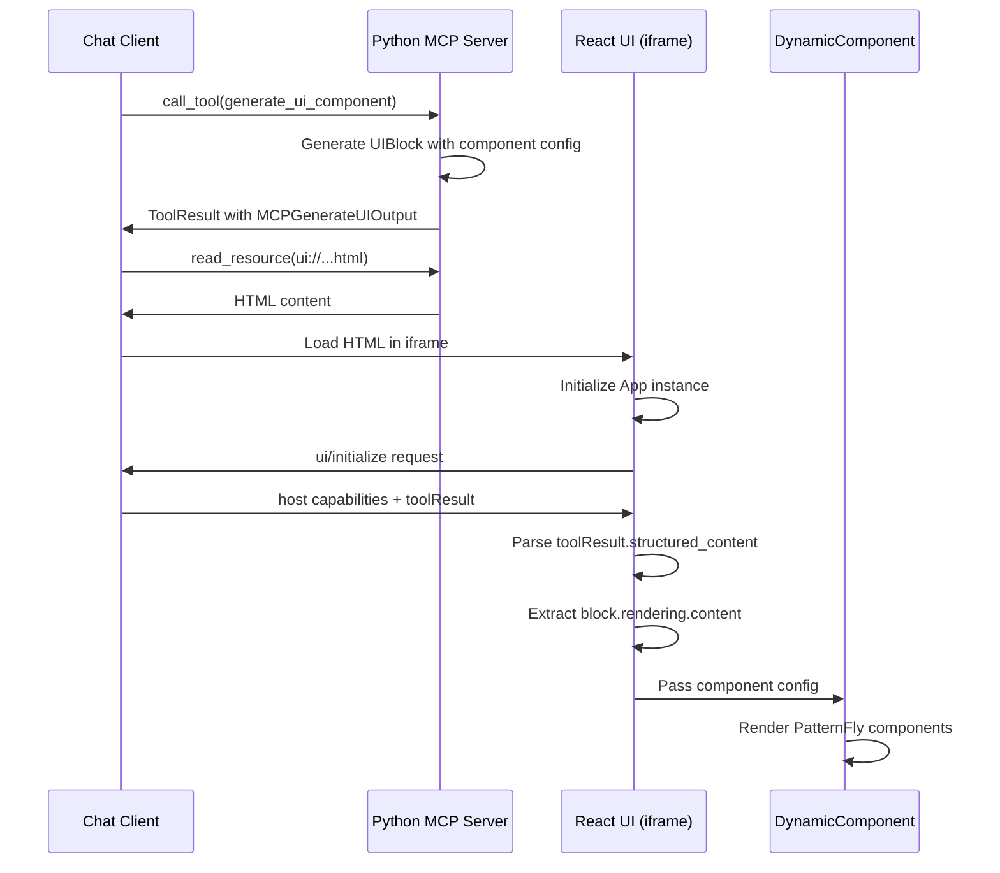

# MCP Apps UI Integration Plan

## Overview

Integrate MCP Apps SDK into the Python MCP server by creating a separate TypeScript module that builds UI components, then modifying the Python tools to serve these as MCP resources.

## Architecture




## Implementation Steps

### 1. Create TypeScript UI Module Structure

**Location:** `/Users/rkozmik/Work/ai-det/next-gen-ui-agent/libs/next_gen_ui_mcp_apps_ui/`

Create the following structure:

```
libs/next_gen_ui_mcp_apps_ui/
├── BUILD                          # Pants build configuration
├── package.json                   # npm dependencies and scripts
├── tsconfig.json                  # TypeScript configuration
├── vite.config.ts                 # Vite bundler configuration
├── mcp-app-single.html           # HTML entry point for single component
├── mcp-app-multiple.html         # HTML entry point for multiple components
├── src/
│   ├── shared/
│   │   ├── types.ts              # Shared TypeScript interfaces
│   │   ├── hooks.ts              # Custom React hooks
│   │   └── components.tsx        # Shared React components
│   ├── mcp-app-single.tsx        # React component for single UI
│   └── mcp-app-multiple.tsx      # React component for multiple UI
└── dist/                          # Build output (gitignored)
    ├── mcp-app-single.html
    └── mcp-app-multiple.html
```

**Key files:**

`package.json`:

```json
{
  "name": "next_gen_ui_mcp_apps_ui",
  "version": "1.0.0",
  "private": true,
  "type": "module",
  "scripts": {
    "build": "npm run build:single && npm run build:multiple",
    "build:single": "cross-env INPUT=mcp-app-single.html vite build",
    "build:multiple": "cross-env INPUT=mcp-app-multiple.html vite build",
    "watch": "concurrently \"npm run watch:single\" \"npm run watch:multiple\"",
    "watch:single": "cross-env INPUT=mcp-app-single.html vite build --watch",
    "watch:multiple": "cross-env INPUT=mcp-app-multiple.html vite build --watch"
  },
  "dependencies": {
    "@modelcontextprotocol/ext-apps": "^1.0.0",
    "@rhngui/patternfly-react-renderer": "^1.1.1",
    "react": "^19.2.0",
    "react-dom": "^19.2.0",
    "victory-legend": "^37.3.6"
  },
  "devDependencies": {
    "@types/react": "^19.2.2",
    "@types/react-dom": "^19.2.2",
    "@vitejs/plugin-react": "^4.3.4",
    "concurrently": "^9.2.1",
    "cross-env": "^10.1.0",
    "typescript": "^5.9.3",
    "vite": "^6.0.0",
    "vite-plugin-singlefile": "^2.3.0"
  }
}
```

`vite.config.ts`:

```typescript
import { defineConfig } from "vite";
import react from "@vitejs/plugin-react";
import { viteSingleFile } from "vite-plugin-singlefile";

const INPUT = process.env.INPUT;
if (!INPUT) {
  throw new Error("INPUT environment variable is not set");
}

export default defineConfig({
  plugins: [react(), viteSingleFile()],
  build: {
    cssMinify: true,
    minify: true,
    rollupOptions: {
      input: INPUT,
    },
    outDir: "dist",
    emptyOutDir: false,
  },
});
```

### 2. Create Shared Modules

`**src/shared/types.ts**` - Common TypeScript interfaces:

```typescript
export interface UIBlock {
  id: string;
  rendering?: {
    id: string;
    component_system: string;
    mime_type: string;
    content: string; // JSON string of component config
  };
  configuration?: any;
}

export interface MCPGenerateUIOutput {
  blocks: UIBlock[];
  summary: string;
}

export interface ToolResultContent {
  text?: string;
  type?: string;
}

export interface ToolResult {
  content?: ToolResultContent[];
  structured_content?: any;
}
```

`**src/shared/hooks.ts**` - Custom React hook for parsing tool results:

```typescript
import { useEffect, useState } from "react";
import type { MCPGenerateUIOutput, ToolResult } from "./types";

interface UseToolResultParserResult {
  componentConfigs: any[];
  error: string | null;
  isLoading: boolean;
}

export function useToolResultParser(toolResult?: ToolResult): UseToolResultParserResult {
  const [componentConfigs, setComponentConfigs] = useState<any[]>([]);
  const [error, setError] = useState<string | null>(null);
  const [isLoading, setIsLoading] = useState(true);

  useEffect(() => {
    if (!toolResult) {
      return;
    }

    try {
      // Parse the tool result to get the MCPGenerateUIOutput
      let output: MCPGenerateUIOutput;

      if (toolResult.structured_content) {
        // Structured content is already an object
        output = toolResult.structured_content as MCPGenerateUIOutput;
      } else if (toolResult.content?.[0]?.text) {
        // Parse JSON from text content
        output = JSON.parse(toolResult.content[0].text);
      } else {
        throw new Error("No tool result data available");
      }

      // Extract component configs from UIBlocks
      const configs = output.blocks
        .filter((block) => block.rendering?.content)
        .map((block) => {
          try {
            return JSON.parse(block.rendering!.content);
          } catch (e) {
            console.error("Failed to parse component config:", e);
            return null;
          }
        })
        .filter(Boolean);

      setComponentConfigs(configs);
      setError(null);
      setIsLoading(false);
    } catch (e) {
      console.error("Error processing tool result:", e);
      setError(e instanceof Error ? e.message : String(e));
      setIsLoading(false);
    }
  }, [toolResult]);

  return { componentConfigs, error, isLoading };
}
```

`**src/shared/components.tsx**` - Shared React components:

```typescript
import React from "react";
import DynamicComponent from "@rhngui/patternfly-react-renderer";

interface ErrorDisplayProps {
  error: string;
}

export function ErrorDisplay({ error }: ErrorDisplayProps) {
  return (
    <div style={{ padding: "20px", color: "red" }}>
      <h1>Error</h1>
      <p>{error}</p>
    </div>
  );
}

interface LoadingDisplayProps {
  message?: string;
}

export function LoadingDisplay({ message = "Loading..." }: LoadingDisplayProps) {
  return (
    <div style={{ padding: "20px" }}>
      <p>{message}</p>
    </div>
  );
}

interface ComponentRendererProps {
  configs: any[];
  spacing?: boolean;
}

export function ComponentRenderer({ configs, spacing = false }: ComponentRendererProps) {
  return (
    <div style={{ padding: "20px" }}>
      {configs.map((config, index) => (
        <div
          key={config.id || index}
          style={spacing ? { marginBottom: "20px" } : undefined}
        >
          <DynamicComponent config={config} />
        </div>
      ))}
    </div>
  );
}
```

### 3. Create React UI Components

`**src/mcp-app-single.tsx**` - Uses shared modules:

```tsx
import React from "react";
import ReactDOM from "react-dom/client";
import { useApp } from "@modelcontextprotocol/ext-apps/react";
import { useToolResultParser } from "./shared/hooks";
import { ErrorDisplay, LoadingDisplay, ComponentRenderer } from "./shared/components";

function SingleComponentUI() {
  const app = useApp();
  const { componentConfigs, error, isLoading } = useToolResultParser(app.toolResult);

  if (error) {
    return <ErrorDisplay error={error} />;
  }

  if (isLoading || componentConfigs.length === 0) {
    return <LoadingDisplay message="Loading component..." />;
  }

  return <ComponentRenderer configs={componentConfigs} />;
}

ReactDOM.createRoot(document.getElementById("root")!).render(<SingleComponentUI />);
```

`**src/mcp-app-multiple.tsx**` - Same simple implementation with spacing between components:

```tsx
import React from "react";
import ReactDOM from "react-dom/client";
import { useApp } from "@modelcontextprotocol/ext-apps/react";
import { useToolResultParser } from "./shared/hooks";
import { ErrorDisplay, LoadingDisplay, ComponentRenderer } from "./shared/components";

function MultipleComponentsUI() {
  const app = useApp();
  const { componentConfigs, error, isLoading } = useToolResultParser(app.toolResult);

  if (error) {
    return <ErrorDisplay error={error} />;
  }

  if (isLoading || componentConfigs.length === 0) {
    return <LoadingDisplay message="Loading components..." />;
  }

  return <ComponentRenderer configs={componentConfigs} spacing />;
}

ReactDOM.createRoot(document.getElementById("root")!).render(<MultipleComponentsUI />);
```

**Key Benefits of Refactoring:**

- **DRY Principle**: Common logic extracted to shared modules (types, hooks, components)
- **Maintainability**: Changes to parsing logic only need to be made in one place
- **Testability**: Shared hooks and components can be unit tested independently
- **Readability**: Main component files are now ~20 lines instead of ~90 lines
- **Reusability**: Shared modules can be used for additional views in the future
- Both files now differ only in the loading message and spacing prop

**HTML entry points** (`mcp-app-single.html` and `mcp-app-multiple.html`):

```html
<!DOCTYPE html>
<html lang="en">
<head>
  <meta charset="UTF-8" />
  <meta name="viewport" content="width=device-width, initial-scale=1.0" />
  <title>Next Gen UI - MCP App</title>
</head>
<body>
  <div id="root"></div>
  <script type="module" src="/src/mcp-app-single.tsx"></script>
</body>
</html>
```

### 3. Configure Pants Integration

`**libs/next_gen_ui_mcp_apps_ui/BUILD**`:

```python
# Install npm dependencies
run_shell_command(
    name="npm_install",
    command="npm install",
    execution_dependencies=[":package_json"],
    workdir=".",
    log_output=True,
)

# Build the UI (produces dist/*.html files)
run_shell_command(
    name="build",
    command="npm run build",
    execution_dependencies=[
        ":npm_install",
        ":package_json",
        ":vite_config",
        ":tsconfig",
        "src:sources",
    ],
    workdir=".",
    log_output=True,
    output_directories=["dist"],
)

# Make package.json and config files available
files(
    name="package_json",
    sources=["package.json", "package-lock.json"],
)

files(
    name="vite_config",
    sources=["vite.config.ts"],
)

files(
    name="tsconfig",
    sources=["tsconfig.json"],
)

files(
    name="html_entries",
    sources=["*.html"],
)

# Source files for TypeScript/React
files(
    name="sources",
    sources=["src/**/*.tsx", "src/**/*.ts", "src/shared/**/*.tsx", "src/shared/**/*.ts"],
)

# Relocate built HTML files to next_gen_ui_mcp/ui_resources/
adhoc_tool(
    name="copy_to_mcp",
    runnable=":build",
    execution_dependencies=[":build"],
    args=[],
    output_directories=["dist"],
    log_output=True,
)
```

**Update `libs/next_gen_ui_mcp/BUILD**` to depend on the UI build:

```python
# Add to the existing `:lib` target dependencies
python_sources(
    name="lib",
    dependencies=[
        "libs/3rdparty/python:mcp",
        "libs/next_gen_ui_agent:lib",
        "libs/next_gen_ui_mcp_apps_ui:copy_to_mcp",  # NEW
    ],
    sources=[
        "!server_example.py",
        "!mcp_client_example.py",
        "!**/*_test.py",
        "**/*.py",
    ],
)

# Add a new target to copy HTML files into ui_resources/
# This will be triggered when building the lib
run_shell_command(
    name="copy_ui_resources",
    command="mkdir -p ui_resources && cp -f ../next_gen_ui_mcp_apps_ui/dist/*.html ui_resources/",
    execution_dependencies=["libs/next_gen_ui_mcp_apps_ui:build"],
    workdir=".",
    log_output=True,
)
```

### 4. Create UI Resources Directory in Python Module

Add to [libs/next_gen_ui_mcp/](next-gen-ui-agent/libs/next_gen_ui_mcp/):

```
libs/next_gen_ui_mcp/
├── ui_resources/           # NEW directory
│   ├── .gitignore         # Ignore built HTML files
│   ├── mcp-app-single.html     # (built by Pants)
│   └── mcp-app-multiple.html   # (built by Pants)
```

`ui_resources/.gitignore`:

```
*.html
```

### 5. Modify Python MCP Server to Serve UI Resources

**Update [libs/next_gen_ui_mcp/agent.py**](next-gen-ui-agent/libs/next_gen_ui_mcp/agent.py):

Add imports at the top:

```python
import os
from pathlib import Path
```

Add constant for UI resources directory (around line 40):

```python
UI_RESOURCES_DIR = Path(__file__).parent / "ui_resources"
RESOURCE_MIME_TYPE = "text/html+mcp-app"
```

**Modify `generate_ui_component` tool** (line 251-358):

Add `_meta` to tool registration:

```python
@self.mcp.tool(
    name="generate_ui_component",
    description=(...),
    enabled="generate_ui_component" in self.enabled_tools,
    exclude_args=["session_id"],
    _meta={
        "ui": {
            "resourceUri": "ui://generate_ui_component/mcp-app-single.html"
        }
    }  # NEW
)
async def generate_ui_component(...) -> ToolResult:
    # existing implementation
```

**Modify `generate_ui_multiple_components` tool** (line 369-421):

Add `_meta` to tool registration:

```python
@self.mcp.tool(
    name="generate_ui_multiple_components",
    description=(...),
    enabled="generate_ui_multiple_components" in self.enabled_tools,
    _meta={
        "ui": {
            "resourceUri": "ui://generate_ui_multiple_components/mcp-app-multiple.html"
        }
    }  # NEW
)
async def generate_ui_multiple_components(...) -> ToolResult:
    # existing implementation
```

**Add resource registration** (after line 487, after the existing `get_system_info` resource):

```python
@self.mcp.resource(
    "ui://generate_ui_component/mcp-app-single.html",
    mime_type=RESOURCE_MIME_TYPE,
)
def get_single_component_ui() -> str:
    """Get the UI for single component generation."""
    html_file = UI_RESOURCES_DIR / "mcp-app-single.html"
    if not html_file.exists():
        raise FileNotFoundError(
            f"UI resource not found: {html_file}. "
            "Run 'pants build libs/next_gen_ui_mcp' to build UI resources."
        )
    return html_file.read_text()

@self.mcp.resource(
    "ui://generate_ui_multiple_components/mcp-app-multiple.html",
    mime_type=RESOURCE_MIME_TYPE,
)
def get_multiple_components_ui() -> str:
    """Get the UI for multiple components generation."""
    html_file = UI_RESOURCES_DIR / "mcp-app-multiple.html"
    if not html_file.exists():
        raise FileNotFoundError(
            f"UI resource not found: {html_file}. "
            "Run 'pants build libs/next_gen_ui_mcp' to build UI resources."
        )
    return html_file.read_text()
```

### 6. Build and Test Flow

**Build command:**

```bash
cd /Users/rkozmik/Work/ai-det/next-gen-ui-agent
pants build libs/next_gen_ui_mcp_apps_ui:build
pants build libs/next_gen_ui_mcp:lib
```

This will:

1. Install npm dependencies in `next_gen_ui_mcp_apps_ui`
2. Build the React apps into single HTML files
3. Copy HTML files to `next_gen_ui_mcp/ui_resources/`
4. Package the Python module with UI resources included

**Development workflow:**

```bash
# Watch mode for UI changes
cd libs/next_gen_ui_mcp_apps_ui
npm run watch

# In another terminal, run the MCP server
pants run libs/next_gen_ui_mcp/server_example.py
```

## Key Technical Details

### Why Single HTML Files?

The `vite-plugin-singlefile` plugin bundles React, the MCP Apps SDK, and all dependencies into a single self-contained HTML file. This simplifies distribution and ensures the Python server only needs to serve one file per UI.

### Data Flow




**Data Structure Flow:**

1. **Python Server Output:**
  ```python
   MCPGenerateUIOutput(
       blocks=[
           UIBlock(
               id="data-123",
               rendering=UIBlockRendering(
                   content='{"component":"data-view","id":"table-1","fields":[...]}'
               )
           )
       ],
       summary="Component rendered"
   )
  ```
2. **React UI Processing:**
  ```typescript
   // Extract from tool result
   const output = app.toolResult.structured_content;

   // Parse component config from rendering.content
   const config = JSON.parse(output.blocks[0].rendering.content);
   // config = {component: "data-view", id: "table-1", fields: [...]}

   // Render with DynamicComponent
   <DynamicComponent config={config} />
  ```
3. **DynamicComponent:**
  - Receives `config` with `component`, `id`, and component-specific props
  - Maps to built-in components (`data-view`, `one-card`, `chart-bar`, etc.)
  - Or uses Hand-Built Components (HBC) from registry
  - Renders PatternFly React components with proper styling

### Pants Automation

The key automation is the dependency chain:

1. `next_gen_ui_mcp:lib` depends on `next_gen_ui_mcp_apps_ui:build`
2. When building the Python lib, Pants automatically builds the UI
3. The copy command ensures HTML files are in the right location

### Using Local next-gen-ui-react Package

If you want to use the local `next-gen-ui-react` package instead of the published npm package, update `package.json`:

```json
{
  "dependencies": {
    "@rhngui/patternfly-react-renderer": "file:../../next-gen-ui-react"
  }
}
```

Or build and link the package locally:

```bash
# In next-gen-ui-react directory
cd /Users/rkozmik/Work/ai-det/next-gen-ui-react
npm run build
npm link

# In next_gen_ui_mcp_apps_ui directory
cd /Users/rkozmik/Work/ai-det/next-gen-ui-agent/libs/next_gen_ui_mcp_apps_ui
npm link @rhngui/patternfly-react-renderer
```

## Testing the Integration

1. **Build everything:**
  ```bash
   pants build libs/next_gen_ui_mcp:lib
  ```
2. **Run the server:**
  ```bash
   pants run libs/next_gen_ui_mcp/server_example.py
  ```
3. **Test with an MCP host** that supports MCP Apps (like Claude Desktop or the basic-host example)
4. **Verify resources are available:**
  ```bash
   # List resources - should show both UI resources
   # Call tools - should trigger UI display in the host
  ```

