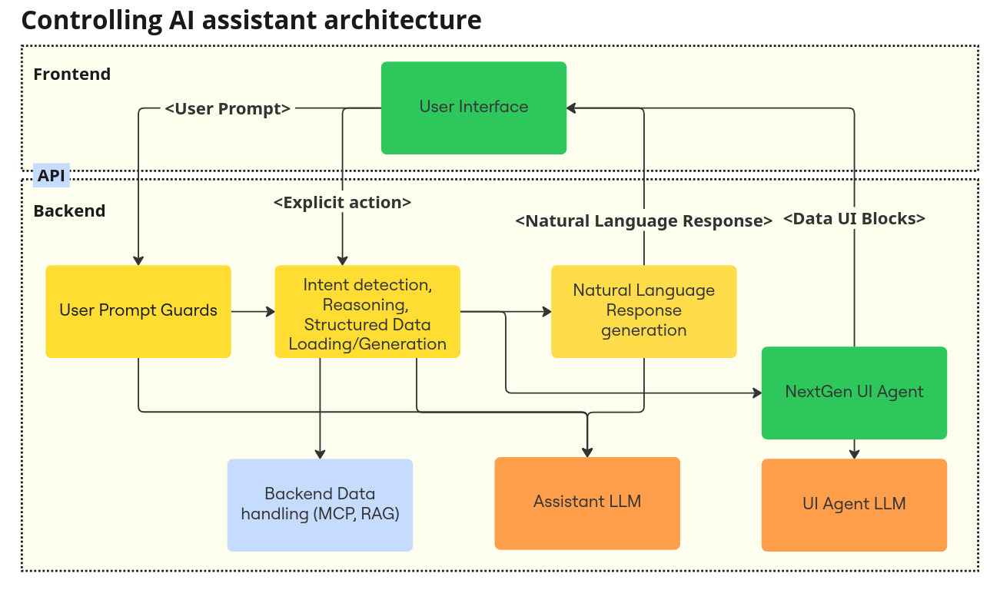

# Architecture

This guide shows how to use *NextGen UI Agent* in your application.

In short, *UI Agent* takes `User Prompt` and [`Structured Data`](./input_data.md) relevant to this prompt as an input, and generates UI component to visualize that piece of data to the user. We call it `Data UI Block`. AI (LLM) is used in this step, to understand the `User Prompt` and data structure and select the best UI component and displayed data values. 

In the future, this agent will also maintain `UI state` and view layouts to keep UI and flows consistent, handle personalized values formating, and many other features. Stay tuned ;-)

Example of the generated `Data UI Block`:

*UI Agent* also suports [*Hand Build Components*](data_ui_blocks/hand_build_components.md) for pieces of data where UI component exists already, or where 
it is needed to provide special visualization or use features on top of
AI generated UI components.

Your application, called *Controlling assistant*, has to provide other building blocks and their orchestration to implement complete solution.

Example of the *Controlling assistant* architecture:

*Controlling assistant* has to load structured data relevant for the `User Prompt` first, before calling the *UI Agent*. 
It can do it directly, for example using `LLM Tools Calling`/`MCP`, or it can call *Data providing agent* in case 
of Multi-Agent architecture. It can even generate that data itself in process of Reasoning or user's intent detection and processing.
*Controlling assistant* can load more pieces of data for one conversation turn, and send them all to the *UI Agent* to generate 
more `AI UI Blocks` to be shown to the user in the assistant's GUI.

*Controlling assistant* can also generate *Natural language response* based on this data and deliver it to the user through GUI or Voice user interface.
To follow vision of the *NextGen UI*, this natural language response should not repeat visualized data, but rather provide 
data summarizations, insights based on the data, proposals of the user actions, etc.
*UI Agent* itself has nothing to do with this response generation, it is responsibility of the *Controlling Assistant* to provide it.

Example mockup of the *Controlling assistant* GUI:

*UI Agent* core works with abstract representation of the [`Data UI Block`](data_ui_blocks/index.md). 
They can be rendered using pluggable GUI component system renderers, and integrated into the GUI of the *Controlling assistant*. 
We provide renderers for several UI component systems, either Server-Side or Client-Side, see [Binding into UI](renderer/index.md).

*UI Agent* can be integrated into *Controlling Assistant* developed using multiple AI frameworks or AI protocols, see [Binding into AI application](ai_apps_binding/index.md).

You can also refer ["Choose your framework"](../installation.md).
