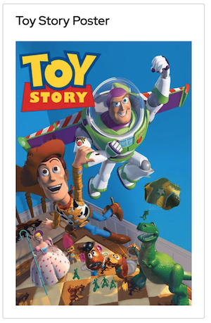

# Data UI Blocks

Next Gen UI Agent generates output and visualize them in Data UI Blocks.
This chapter list all available data blocks that the agent can generate and render.

## Card

Card is UI block that displays:

  * Title
  * Facts list
  * Image (if present)

Facts are name-value pairs, where the `name` is AI generated and the `value` is gathered from agent's input data.
Value can be simple text or number. List (array) of values is supported as well.

Example rendering by Red Hat Design System for user prompt `Tell me details about Toy Story`:

## Image

Image is UI block to display a single image with a title.

Example rendering by Red Hat Design System for a prompt `Show me poster of Toy Story movie`:

Image is found by agent from backend-data either by field value or by field name. See the [spec/component/image.schema.json](https://github.com/RedHat-UX/next-gen-ui-agent/blob/main/spec/component/image.schema.json) for more details.

## Video Player

Video player is UI block to play a single video from provided URL e.g. youtube.

Example rendering by Red Hat Design System for a prompt `Play trailer of Toy Story movie`:

