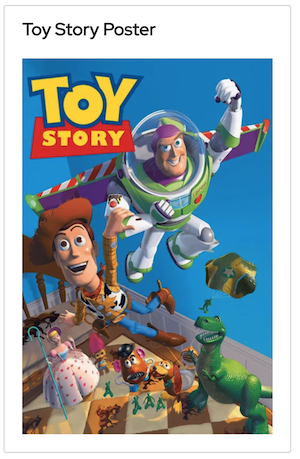

# AI selected and configured dynamic components

These fully AI selected and generated *Data UI Blocks* are now supported by *UI Agent*. 

## Card

Component identification: [`one-card`](../spec/component.md#one-card)

Card is UI block that displays:

  * Title
  * Facts list
  * Image (if present in input data)

Facts are name-value pairs, where the `name` is AI generated and the `value` is gathered from agent's input data.
Value can be simple text or number. List (array) of values is supported as well.

Example rendering by Red Hat Design System for user prompt `Tell me details about Toy Story`:

## Image

Component identification: [`image`](../spec/component.md#image)

Image is UI block to display a single image with a title.

Example rendering by Red Hat Design System for a prompt `Show me poster of Toy Story movie`:

Image is found by agent from backend-data either by field value or by field name. See the [spec/component/image.schema.json](https://github.com/RedHat-UX/next-gen-ui-agent/blob/main/spec/component/image.schema.json) for more details.

## Video Player

Component identification: [`video-player`](../spec/component.md#video-player)

Video player is UI block to play a single video from provided URL (only youtube supported ATM).

Example rendering by Red Hat Design System for a prompt `Play trailer of Toy Story movie`:

