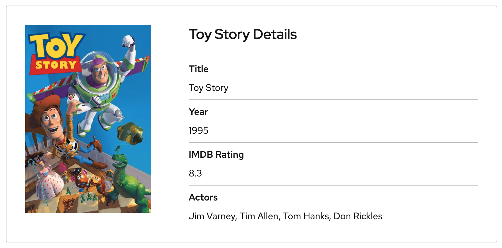

# Next Gen UI Agent

The goal of this AI agent is to generate personalised and rich UI components based on 
the user prompt, chat history and backend data provided by other agent in your AI assistant.

In the future, this agent will also maintain UI state and view layouts to keep UI and flows 
consistent, handle personalized values formating, and many other features. Stay tuned ;-)

## Why use Next Gen UI Agent?

* `Rich user experience` - Extends simple text based LLM applications output by rich GUI components like card, table, chart, 
video-player, image gallery etc. Possibility to plug in own components.
* `Extensible architecture` - Developer's choice to which AI framwork to plug and which UI component framework to render.
* `AI Frameworks integration` - Seamless integration of various AI framworks.
* `Server (Agent) side UI rendering` - Powerful agent centralized HTML (e.g. web component) rendition.
* `Client side UI rendering` - Client side rendering for more control over the rendition - React/PatternFly NPM.

Example of rich card component including image and other values from structured data.

## How to use Next Gen UI Agent?

Our [Architecture guide](guide/architecture.md) shows how to use Next Gen UI Agent in your AI assistant application. 
Other guides provide more details then.

You can also look at [LangGraph & Web Components quickstart](quickstart/langgraph_web_components.md) or
run [Movies assistant (LangGraph) example](example/langgraph_movies.md) to taste the *UI agent*.

