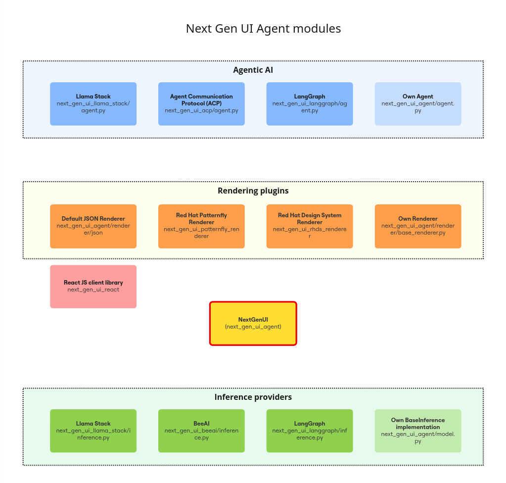
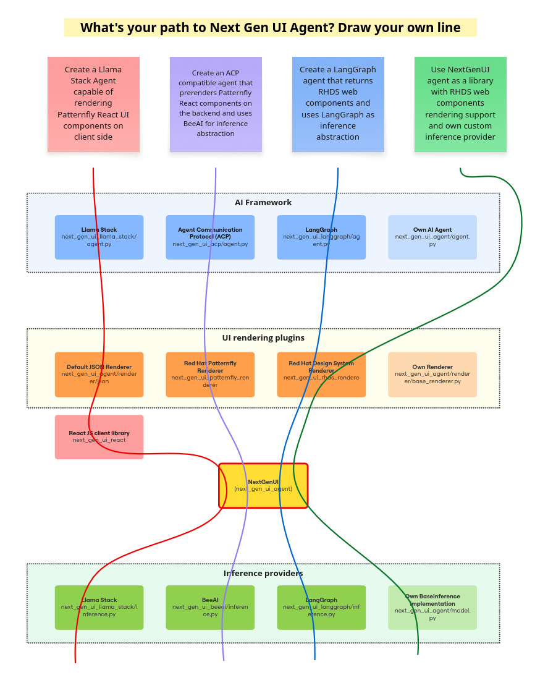

# Choose your framework

NextGenUI Agent mono repository offers a variety of options for you to align the agent to your environment needs. 
We took an approach where core implementation is agnostic to inference provider, [UI rendering plugin](guide/renderer/index.md) and [AI framework](guide/ai_apps_binding/index.md).
This way you have full flexibility in picking the right pieces and conveniently using it.

If any particular AI framework or UI rendering option is not available out of the box, it's easy to implement it and use with any other piece of the stack.

In the diagram below you can see each layer of NextGen UI Agent from which you need to pick the right piece for you. Each module not only 
mentions the dependency name but also internal python script where that particular functionality is implemented.

The repository organises the sources from the perspective of dependencies and usually you should align your choices to those to prevent unnecesary bloating 
of your dependency tree. However, you're free to choose any module from any row, so it's fine to use Llama-Stack Agent but inference from BeeAI even 
if it doesn't make too much sense.

Another diagram in a form of lines visualises how you can combine those modules into a package to use.

Consult our [Architecture guide](guide/architecture.md) and other guides for more details.