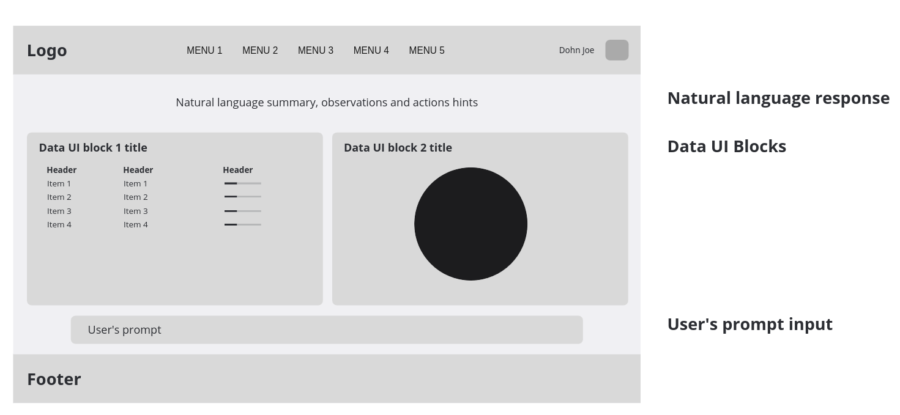

This guide shows how to use *NextGen UI Agent* in your application.

In short, *UI Agent* takes `User Prompt` and [`Structured Data`](./input_data.md) relevant to this prompt as an input, and generates UI component to visualize that piece of data to the user. We call it `Data UI Block`. LLM is used in this step, to understand the `User Prompt` and data structure and select the best UI component and displayed data values.

Example of the generated `Data UI Block`:

Your application, called *Controlling assistant*, has to provide other building blocks and their orchestration to implement complete solution.

Example of the *Controlling assistant* architecture:

*Controlling assistant* has to load structured data relevant for the `User Prompt` first, before calling the *UI Agent*. 
It can do it directly, for example using `LLM Tools Calling`, or it can call *Data providing agent* in case of Multi-Agent architecture. 
*Controlling assistant* can load more pieces of data for one conversation turn, and send them all to the *UI Agent* to generate more `AI UI Blocks` to be shown to the user in the assistant's GUI.

*Controlling assistant* can also generate *Natural language response* based on this data and deliver it to the user through GUI or Voice user interface.
To follow vision of the *NextGen UI*, this natural language response should not repeat visualized data, but rather provide data summarizations, insights based on the data, proposals of the user actions, etc.
*UI Agent* itself has nothing to do with this response generation, it is responsibility of the *Controlling Assistant* to provide it.

Example mockup of the *Controlling assistant* GUI:

*UI Agent* core works with abstract representation of the `Data UI Block`, which can be rendered using pluggable GUI component system renderers, and integrated into the GUI of the *Controlling assistant*. We provide renderers for several UI component systems, either Server-Side or Client-Side (**ToDo** link to the relevant chapter).

*UI Agent* can be integrated into *Controlling Assistant* developed using multiple AI frameworks (**ToDo** link to the relevant chapter).

